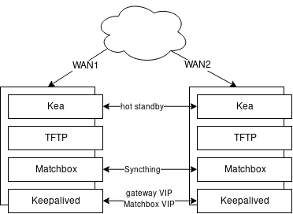

## Terraform configs for provisioning homelab resources

All VMs run on [CoreOS Container Linux](https://coreos.com/os/docs/latest/) using [Ignition](https://coreos.com/ignition/docs/latest/) for boot time configuration.

Config rendering is handled by [CoreOS Matchbox](https://github.com/coreos/matchbox/).

[HashiCorp Terraform](https://www.hashicorp.com/products/terraform) is used in all steps. The following plugins are used:
- [Matchbox plugin](https://github.com/coreos/terraform-provider-matchbox)
- [Syncthing devices plugin](https://github.com/randomcoww/terraform-provider-syncthing)

S3 is used as the backend store for Terraform and requires AWS access from the dev environment.

The hypervisor and all VMs run on RAM disk and keep no state. Any persistent configuration is intended to live on shared NFS (at 192.168.126.251 in my case).

### Renderer

[Renderer](setup_renderer) generates minimal configuration for standing up a local Matchbox server that accepts configuration from terraform and provides rendered configuration over http.
This is used to render configuration that cannot be provided over PXE (i.e. provisioner for the PXE server itself and hypervisor that they run on).

Generate TLS for local Matchbox
```bash
cd setup_renderer
terraform init
terraform apply
```

Start local Matchbox on Docker
```bash
./run_matchbox.sh
```

Service runs at:
```
http://127.0.0.1:8080
```

### Provisioner

[Provisioner](setup_provisioner) generates configuration for the PXE boot environment on the local Matchbox instance. Provisioner consists of a network gateway with Nftables and a PXE environment with a Matchbox instance of its own, DHCP and TFTP.

```bash
cd setup_provisioner
terraform init
terraform apply
```

#### Hypervisor image

Generate hypervisor images:
```bash

git clone https://github.com/randomcoww/lorax
cd lorax

wget \
    https://download.fedoraproject.org/pub/fedora/linux/releases/29/Server/x86_64/iso/Fedora-Server-netinst-x86_64-29-1.2.iso

wget -O store-0.ks \
    http://127.0.0.1:8080/generic?ks=store-0

sudo livemedia-creator \
    --make-iso \
    --iso=./Fedora-Server-netinst-x86_64-29-1.2.iso \
    --project store \
    --volid store \
    --releasever 29 \
    --title store \
    --resultdir ./result \
    --ks=./store-0.ks \
    --no-virt \
    --lorax-templates ./share

wget -O store-1.ks \
    http://127.0.0.1:8080/generic?ks=store-1
    
sudo livemedia-creator \
    --make-iso \
    --iso=./Fedora-Server-netinst-x86_64-29-1.2.iso \
    --project store \
    --volid store \
    --releasever 29 \
    --title store \
    --resultdir ./result \
    --ks=./store-1.ks \
    --no-virt \
    --lorax-templates ./share
```
These images can be written to a USB flash drive.

#### Provisioner VM

Provisioner VMs serving PXE also serve as the WAN gateway intended to boot on ISP DHCP. Ignition configuration is pushed to and served from [env-provisioner](https://github.com/randomcoww/env-provisioner) at boot time.

Copy and push CoreOS ignition configs to repo:
```bash
git clone git@github.com:randomcoww/env-provisioner.git
cd env-provisioner/ignition

wget -O provisioner-0.ign \
    http://127.0.0.1:8080/ignition?ign=provisioner-0
wget -O provisioner-1.ign \
    http://127.0.0.1:8080/ignition?ign=provisioner-1
    
git add provisioner-0.ign provisioner-1.ign
...
```

Provisioners need Container Linux PXE boot images on the host filesystem to boot. Looking for possible workarounds to this such as booting a more miminal GRUB image that is able to download these at boot time.

**TODO**: Investigate
* https://lists.gnu.org/archive/html/help-grub/2013-08/msg00037.html
* http://www.manobit.com/pxe-multi-boot-server-using-grub2-on-mikrotik-routeros-bios-and-efi-support/

Compatible KVM libvirt configurations are in [env-provisioner](https://github.com/randomcoww/env-provisioner). I currently have no automation for defining and starting VMs.
```bash
virsh define provisioner-0.xml
virsh define provisioner-1.xml

virsh start provisioner-0
...
```

The provisioner steps are generally ugly and need revising.

DHCP (Kea) instances run in hot-standby. Matchbox instances share configuration over Syncthing. This data is lost if all instances are rebooted at the same time.



#### Terraform output

SSH CA private key for the hypervisor and provisioner VMs:
```
setup_provisioner/output/ssh-ca-key.pem
```

### Kubernetes and remaining environment

[Setup environment](setup_environment) handles generating PXE boot configurations that are pushed to the provisioner. This currently consists of a three master and two worker Kubernetes cluster.

Etcd, in addition to most other services in my lab, runs on RAM disk, but is periodically backed up to S3 and recovered as needed. Custom [etcd-wrapper](https://github.com/randomcoww/etcd-wrapper) tool is used to manage this.

Populate provisioner Matchbox instance:
```bash
cd setup_environment
terraform init
terraform apply
```

Compatible KVM libvirt configurations are in [env-provisioner](https://github.com/randomcoww/env-provisioner). I currently have no automation for defining and starting VMs.
```bash
virsh define controller-0.xml
virsh define controller-1.xml
virsh define controller-2.xml
virsh define worker-0.xml
virsh define worker-1.xml

virsh start controller-0
...
```

#### Terraform output

SSH CA private key for the Kubernetes VMs:
```
setup_environment/output/ssh-ca-key.pem
```

Admin kubeconfig:
```
setup_environment/output/kube-cluster/<name_of_cluster>/admin.kubeconfig
```

### Desktop provisioning

[Setup desktop](setup_desktop) generates a kickstart for my desktop box. The following disk with existing partitions is assumed and the home partition is not formatted:

```
part /boot/efi --fstype=efi --size=200 --onpart /dev/nvme0n1p1
part /boot --fstype=ext4 --size=512 --onpart /dev/nvme0n1p2
part / --fstype=ext4 --size=20480 --onpart /dev/nvme0n1p3
part /home --fstype=ext4 --size=1024 --grow --noformat --onpart /dev/nvme0n1p4
```

Generate Kickstart:
```bash
cd setup_desktop
terraform init
terraform apply
```

I currently have no PXE boot environment for Fedora. The following boot args can be added to a Fedora 29 installer to use, where 192.168.126.242:58080 is the provisioner Matchbox address.
```
inst.text inst.ks=http://192.168.126.242:58080/generic?ks=desktop-0
```
